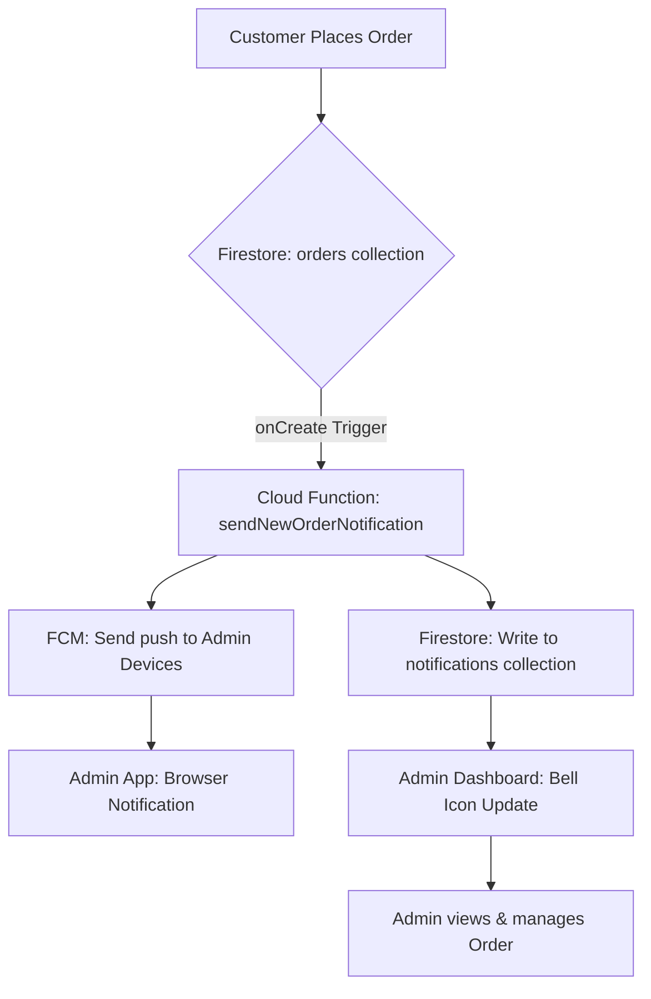
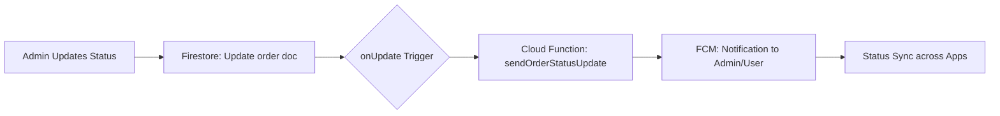

# 🛒 Pakur Mart Admin Panel

A premium, state-of-the-art administration dashboard for **Pakur Mart**, designed to manage orders, products, deliveries, and notifications with speed and elegance.

---

## 🚀 Tech Stack

### Frontend
- **Framework**: [React](https://react.dev/) + [Vite](https://vitejs.dev/)
- **Styling**: [Tailwind CSS](https://tailwindcss.com/) + [Radix UI](https://www.radix-ui.com/) (Premium Components)
- **State Management**: [TanStack Query](https://tanstack.com/query/latest) (React Query)
- **Routing**: [Wouter](https://github.com/molecularjs/wouter)
- **Icons**: [Lucide React](https://lucide.dev/)
- **Visuals**: [Framer Motion](https://www.framer.com/motion/) (Micro-animations)

### Backend & Infrastructure
- **Base**: [Firebase](https://firebase.google.com/)
- **Database**: [Firestore](https://firebase.google.com/docs/firestore)
- **Functions**: [Cloud Functions for Firebase](https://firebase.google.com/docs/functions) (Node.js)
- **Messaging**: [Firebase Cloud Messaging (FCM)](https://firebase.google.com/docs/cloud-messaging)
- **Validation**: [Zod](https://zod.dev/)

---

## 🛠 Features

- **Real-time Order Management**: Live tracking of orders with status updates.
- **Dynamic Product Control**: Add, edit, and filter products by location and category.
- **Smart Notifications**: Push notifications for new orders and status changes via FCM.
- **Delivery Integration**: Assign and manage delivery partners for efficient fulfillment.
- **Premium UI**: Dark mode support, smooth transitions, and responsive layout.

---

## 🏗 System Architecture

### Order & Notification Flow
The following flowchart illustrates how a new order triggers system-wide updates:



### Order Status Update Workflow


---

## 📂 Project Structure

```text
pakurmart-admin/
├── bolpurmart-admin/
│   ├── client/              # Frontend Application
│   │   ├── src/
│   │   │   ├── components/  # Reusable UI components
│   │   │   ├── pages/       # Dashboard & Login pages
│   │   │   ├── services/    # Firebase & Business logic
│   │   │   ├── hooks/       # Custom React hooks
│   │   │   └── lib/         # Configuration & Utils
│   ├── functions/           # Firebase Cloud Functions
│   │   └── index.js         # Backend triggers (FCM logic)
│   ├── firebase.json        # Firebase Hosting & Functions config
│   └── package.json         # Main project dependencies
```

---

## ⚙️ Getting Started

### Prerequisites
- Node.js (v18+)
- Firebase CLI (`npm install -g firebase-tools`)

### Installation

1. **Clone the repository**
   ```bash
   git clone <repository-url>
   cd pakurmart-admin/bolpurmart-admin
   ```

2. **Install Dependencies**
   ```bash
   npm install
   cd functions && npm install && cd ..
   ```

3. **Environment Setup**
   Create a `.env` file in the `client` directory based on `.env.example`:
   ```env
   VITE_FIREBASE_API_KEY=your_key
   VITE_FIREBASE_AUTH_DOMAIN=your_domain
   # ... add other variables
   ```

4. **Run Locally**
   ```bash
   npm run dev
   ```

5. **Deploy Functions**
   ```bash
   firebase deploy --only functions
   ```

---

## 💡 Implementation Highlights

- **FCM Service Worker**: Implemented a robust service worker in the client for reliable background notifications even when the app is closed.
- **Idempotent Notifications**: Cloud functions use the `orderId` as the document ID for notifications to prevent duplicate alerts.
- **Type Safety**: End-to-end type safety using Zod schemas for order data and product models.

---

Made with ❤️ for **Pakur Mart**.
