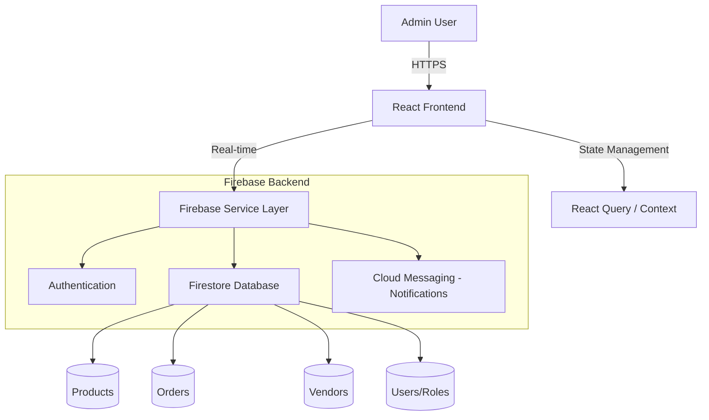
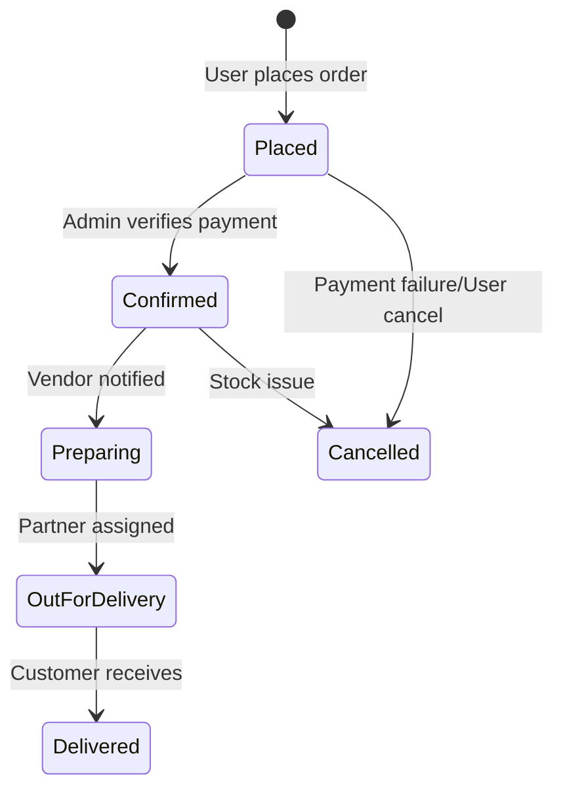

# Pakur Mart Admin Panel 🚀

[](https://reactjs.org/)
[](https://vitejs.dev/)
[](https://firebase.google.com/)
[](https://tailwindcss.com/)

A premium, high-performance administrative dashboard designed for **Pakur Mart** (formerly Bolpur Mart). This application manages the entire ecosystem including products, multi-vendor operations, order lifecycles, and delivery logistics.

---

## 🛠 Tech Stack

| Category | Technology |
| :--- | :--- |
| **Frontend Framework** | React 18 (TypeScript) |
| **Build Tool** | Vite |
| **Styling** | Tailwind CSS + Shadcn/UI + Lucide Icons |
| **State Management** | React Query + React Context API |
| **Backend Services** | Firebase (Auth, Firestore, Cloud Messaging) |
| **Animations** | Framer Motion + Tailwind Animate |
| **Data Handling** | Zod + React Hook Form |

---

## 🏗 System Architecture



---

## 🔄 Order Lifecycle Workflow



---

## 📂 Project Structure

```text
bolpurmart-admin/
├── client/                 # Frontend Application
│   ├── src/
│   │   ├── components/     # UI & Feature Components
│   │   ├── services/       # Firebase Logic (Orders, Auth, Deliveries)
│   │   ├── contexts/       # Global State (Auth, Theme)
│   │   ├── hooks/          # Custom Hooks (Toasts, Auth)
│   │   ├── types/          # TypeScript Interfaces
│   │   └── pages/          # Top-level Views (AdminPanel, Login)
│   └── public/             # Static Assets & Service Workers
├── firebase.json           # Firebase Hosting/Rules Config
├── tailwind.config.ts      # Styling System
└── package.json            # Scripts & Dependencies
```

---

## 🚀 Getting Started

### Prerequisites
- Node.js (v18+)
- npm or yarn

### Local Setup

1. **Clone and Install**
   ```bash
   npm install
   ```

2. **Environment Configuration**
   Create a `.env` file in the `client/` directory based on `.env.example`:
   ```env
   VITE_FIREBASE_API_KEY=your_key
   VITE_FIREBASE_AUTH_DOMAIN=your_project.firebaseapp.com
   VITE_FIREBASE_PROJECT_ID=your_project_id
   ```

3. **Run Development Server**
   ```bash
   npm run dev
   ```

### Deployment
The project is configured for **Firebase Hosting**.
```bash
npm run build
firebase deploy
```

---

## 🛡 Security & Rules
- **Authentication**: Firebase Auth with role-based access (Admin/Sub-admin).
- **Firestore Rules**: Restricted access based on admin roles defined in `firebase.rules`.

---

## ✨ Key Features
- **Real-time Metrics**: Live dashboard with revenue and order growth analytics.
- **Inventory Control**: Comprehensive product and category management.
- **Vendor Dashboard**: Dedicated section for managing partner vendors.
- **Logistics**: Integrated delivery partner tracking and assignment.
- **Automated Notifications**: FCM-powered alerts for new transactions.

---
*Generated for Pakur Mart*
